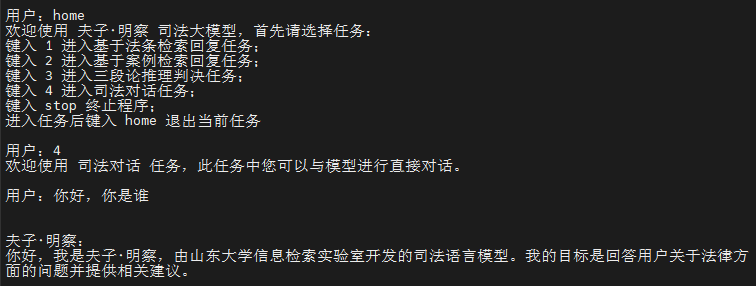

## 依赖库安装

1. 本项目的数据库检索部分使用 [PyLucene](https://lucene.apache.org/pylucene/index.html) 实现，其安装步骤请参考[官方说明](https://lucene.apache.org/pylucene/install.html)

2. 夫子•明察的部署与 [ChatGLM](https://github.com/THUDM/ChatGLM-6B/tree/main#%E4%BD%BF%E7%94%A8%E6%96%B9%E5%BC%8F) 相同，在命令行下执行 ` pip install -r requirements.txt` 即可

## 检索模块部署

本项目检索模块使用 **pylucene** 进行构建，您也可以尝试使用其他检索方式，以下是 pylucene 的部署方式。

您可以直接运行以下代码进行部署

```python
python ./pylucene_task/csv_files/api.py --port "端口"
```

如果想更换检索数据集，可以参考我们的检索数据库格式自行进行修改： `./pylucene_task/csv_files/data_task.csv`
。您也可以简单的修改 `./pylucene_task/csv_files/api.py` 中的代码支持更多的数据类型。

## 命令行 Demo




运行仓库中 [cli_demo.py](cli_demo.py)：

```python
python cli_demo.py --url_lucene_task1 "法条检索对应部署的 pylucene 地址"  --url_lucene_task2 "类案检索对应部署的 pylucene 地址"
```